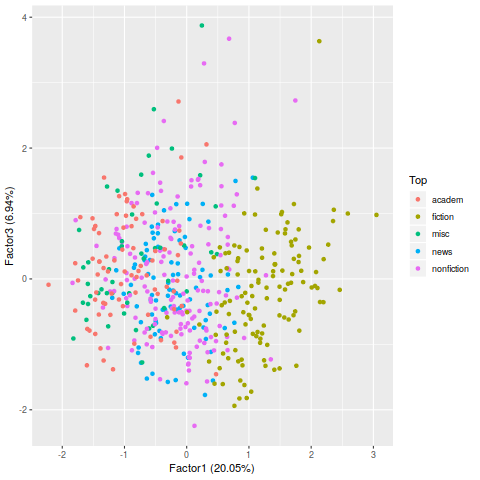

# Multilingual Python version for Biber's Multi-Dimensional Analysis (MDA)

This is a Python script for extracting Biber-like features for English, French, Russian and Spanish as well as R scripts for Multi-Dimensional Analysis.

Back in 1988 Douglas Biber developed an approach to analysing the composition of a corpus by using a set of extractable features followed by factor analysis, see his first book on the topic:
[https://books.google.co.uk/books?id=CVTPaSSYEroC]

An article-length description is available from [http://www.aclweb.org/anthology/J93-2001]

While this approach is more than 30-years old by now, his attention to designing extractable features is still important for understanding how linguistic features vary in texts of different kinds, so that that we can explain the behaviour of Large Language Models.  See a way of linking the features to predictions of a neural classifier:
```
@Article{sharoff2021registerstudies,
  author = {Sharoff, Serge},
  title =  {Genre Annotation for the Web: text-external and text-internal perspectives},
  journal = {Register studies},
  year =   2021,
  volume = 3,
  issue = 1,
  doi = {https://doi.org/10.1075/rs.19015.sha}
```
[https://ssharoff.github.io/publications/2021-register.pdf]

## Biber features
The features proposed by Biber and implemented in my tagger include:

* Lexical features, such as:
  * publicVerbs = *acknowledge, admit, agree, assert, claim, complain, declare, deny...*
  * timeAdverbials  = *afterwards, again, earlier, early, eventually, formerly, immediately,...*
  * amplifiers = *absolutely, altogether, completely, enormously, entirely,...*
* Part-of-speech features, such as:
  * Nominalisations (nouns ending in *-tion, -ness, -ment*)
  * Prepositions
  * Past tense verbs
* Syntactic features, such as:
  * *be* as the main verb
  * *that* deletions
  * pied piping (as in *Which house did she buy?* where *house* moved from its expected position after *buy*)
* Text-level features, such as:
  * Average word length
  * Average sentence length
  * Type/token ratio

In our Intellitext project (2011-2012) we have implemented these features in a [Web interface to corpora](http://corpus.leeds.ac.uk/it/) in Perl, see:
```
@inproceedings{wilson10paclic,
  title={Advanced corpus solutions for humanities researchers},
  author={Wilson, James and Hartley, Anthony and Sharoff, Serge and Stephenson, Paul},
  booktitle={Proc PACLIC 24},
  pages={36--43},
  month={November},
  address={Tohoku University},
  year={2010}
}
```
[http://www.aclweb.org/anthology/Y10-1089]

Since then, I ported the feature extractor from Perl to Python to help with my research on text classification.  Also I have ported the available word lists to French and Russian, and Gonzalo Cruz has done this for Spanish, so that the Biber dimensions of variation can be extracted across languages.

The arguments for the script are self-explanatory (run `python3 biber-dim.py -h`).  A typical invocation would be:

`python3 biber-dim.py -l en <brown.ol >brown.dat`

The default format for the corpus file is one line per document with lemmas and POS tags coming from a dictionary.  It is also possible to achieve better accuracy by using a JSON file with the output of a POS tagger. For example, the JSON file can be produced by using a model from Spacy:
`./spacy2json.py brown.ol en_core_web_lg >brown.json`
`python3 biber-dim.py -f json -l en <brown.json >brown-json.dat`

or in a bit more complicated way from UDPipe (by converting CONLL to JSON):
`udpipe --tokenize --tag english-ewt.udpipe <brown.ol | restoredocids.py | conll2json.py >brown.json`
`python3 biber-dim.py -f json -l en <brown.json >brown-json.dat`

See `brown.ol` and `brown.json` files in this repository, as produced from the Brown corpus. See also  `brown-names.txt` for the descriptions of each individual file in the Brown corpus.

The script assumes that its folder contains a file with language-specific properties with the name LANGUAGE.properties. The format of the lists of properties is as follows:
```
privateVerbs = anticipate,assume,believe,conclude,decide,demonstrate...
```

The property ids are fixed (the label `privateVerbs` is used for all languages), while the word lists are language-specific, for example, for French:
```
privateVerbs = anticiper, assumer, croire, conclure, décider, démontrer...
```

If the script is used without automatic taggers (stored as JSON), just from plain text file, it also needs a frequency list with the name LANGUAGE.tag.num, which contains the following columns:

num | word | lemma | pos | UD morph
----|------|-------|-----|------
1625260 | years | year | NOUN | Number=Plur
399401  | went  | go   | VERB | Tense=Past

This can be obtained, for example, from a large available corpus with the annotations in the format of the [Universal Dependencies](http://universaldependencies.org) by

`cut -f 2-4,6 -s CORPUS.conll | sort | uniq -c | sort -nsr >CONLLU.tag.num`

## Multidimensional analysis

My `biber-dim.py` script produces a tab-separated table with values for each Biber feature.  They are mostly rates (the number of instances divided by the text length in words).  This file can be processed in R for factor analysis and plot making:

`Rscript biber-mda.R brown-biber.dat brown-annot.dat`

The annot.dat file is optional.  It assigns each text in the original ol file to a genre category, so that the texts can be displayed on a plot with meaningful annotations.  Here is the plot for the Brown Corpus top-level genre categories:


